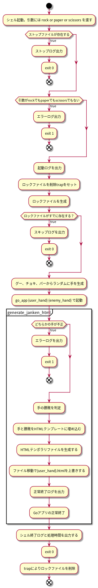

# アプリ設計

Webページに表示されるコンテンツを更新するアプリの設計方針を記載。

## 配信コンテンツ内容

配信コンテンツは以下の4つ。

- http://{ip}/index.html http://{ip}/hand/rock.html
- http://{ip}/hand/paper.html
- http://{ip}/hand/scissors.html

コンテンツの内容は下記の通り。

### index.html

以下のリンクを記載。

- rock.htmlのリンク
- paper.htmlのリンク
- scissors.htmlのリンク

### rock.html

グーを出したときの相手(Webシステム)側の出した手と、その勝敗。

### paper.html

チョキを出したときの相手(Webシステム)側の出した手と、その勝敗。

### scissors.html

パーを出したときの相手(Webシステム)側の出した手と、その勝敗。

## アプリ処理概要

前述のコンテンツを生成するためにGoアプリを作成し、Webサーバ上に配置する。
後述のトリガーによりGoアプリを起動し、コンテンツを更新する。

### アプリ実行トリガー

毎分cronを起動し、1分の起動の間に1秒おきにGoプロセスを起動し、htmlコンテンツを更
新する。

### アプリ処理ロジック

