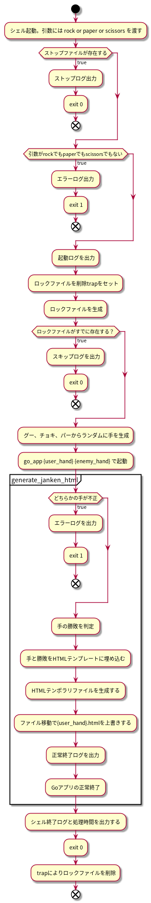

# アプリ詳細設計

各アプリの詳細設計を記載。

## アプリ一覧

- generate_janken_html.go
- start_generate_janken_html.sh
- start_generate_janken_html.sh

※ここでいうアプリとは、Goのバイナリと起動用シェル２つを合わせる指す。  
明確にGoかシェルかを区別したい場合はGoアプリ、シェルアプリと明記すること。

## generate_janken_html.sh

### 処理概要

ユーザの手をうけとり、Goアプリに乱数で生成した対戦相手の手とともに引数として渡す。

### 引数

| 型 | 値域 | 説明 |
|---|---|---|
| string | rock paper scissorsのいずれか1つ | ユーザの手 |

## generate_janken_html.go

### 処理概要

ユーザの手と対戦相手の手を判別し、HTMLファイルを生成し所定位置に配置する。

### 引数

| 型 | 値域 | 説明 |
|---|---|---|
| string | rock paper scissorsのいずれか1つ | ユーザの手 |
| string | rock paper scissorsのいずれか1つ | 対戦相手の手 |

### 処理ロジック

### 出力

| パス                             | URL                            | 説明   | コンテンツ内容 |
|----------------------------------|--------------------------------|--------|----------------|
| /var/www/html/hand/rock.html     | http://{ip}/hand/rock.html     | グー   | 勝敗           |
| /var/www/html/hand/paper.html    | http://{ip}/hand/paper.html    | パー   | 勝敗           |
| /var/www/html/hand/scissors.html | http://{ip}/hand/scissors.html | チョキ | 勝敗           |

